<p align="center">

</p>

<p align="center">

</p>

<h1 align="center">☁️ AWS Static Website Hosting with CI/CD</h1>

<p align="center">
A production-inspired AWS DevOps project demonstrating secure static website deployment using <b>Amazon S3</b>, <b>CloudFront</b>, <b>CodePipeline</b>, <b>CloudWatch</b>, <b>IAM</b>, and <b>Amazon SNS</b>.
</p>

<p align="center">


</p>

<p align="center">


</p>

---

# 📖 Project Overview

This project demonstrates how to deploy a **secure, scalable, and globally distributed static website** using Amazon Web Services (AWS).

The solution combines **Amazon S3** for hosting, **Amazon CloudFront** for global content delivery, **AWS CodePipeline** for Continuous Integration and Continuous Deployment (CI/CD), **Amazon CloudWatch** for monitoring, **Amazon SNS** for notifications, and **IAM** for secure access management.

The project follows AWS security best practices, including **Origin Access Control (OAC)** and **least-privilege IAM permissions**, providing a real-world introduction to AWS DevOps workflows.

---
# 🎯 Project Objectives

This project was designed to demonstrate the practical implementation of AWS cloud services by deploying a secure and production-inspired static website using modern DevOps practices.

### Objectives

- 🌐 Deploy a static website using Amazon S3
- 🚀 Deliver content globally using Amazon CloudFront
- 🔒 Secure the origin with Origin Access Control (OAC)
- 🔄 Automate deployments using AWS CodePipeline
- 📊 Monitor infrastructure using Amazon CloudWatch
- 📧 Configure email alerts with Amazon SNS
- 👥 Implement IAM users, groups, and least-privilege permissions
- 📁 Manage source code using GitHub

---

# ✨ Key Features

| Feature | Description |
|----------|-------------|
| 🌐 Static Website Hosting | Hosted on Amazon S3 |
| ⚡ Global Content Delivery | Delivered through Amazon CloudFront CDN |
| 🔒 Secure Access | Protected using Origin Access Control (OAC) |
| 🔄 Automated Deployment | Continuous deployment using AWS CodePipeline |
| 📦 Version Control | Source code managed with GitHub |
| 📊 Monitoring | CloudWatch Dashboard and Metrics |
| 🚨 Alerting | CloudWatch Alarms with Amazon SNS notifications |
| 👥 IAM Security | Role-based access with IAM Users and Groups |
| 💻 Responsive Website | Built using HTML, CSS and JavaScript |

---

# ☁️ AWS Services Used

| AWS Service | Purpose |
|--------------|---------|
| **Amazon S3** | Hosts the static website files securely |
| **Amazon CloudFront** | Delivers website content globally using a Content Delivery Network (CDN) |
| **AWS IAM** | Manages authentication, authorization, users, and groups |
| **AWS CodePipeline** | Automates deployment from GitHub to Amazon S3 |
| **Amazon CloudWatch** | Monitors application and infrastructure metrics |
| **Amazon SNS** | Sends email notifications when alarms are triggered |
| **GitHub** | Version control and source code repository |

---

# 🏗️ Solution Architecture

```
                    GitHub Repository
                            │
                            ▼
                  AWS CodePipeline
                            │
                            ▼
                  Amazon S3 Bucket
              (Static Website Hosting)
                            │
             Origin Access Control (OAC)
                            │
                            ▼
          Amazon CloudFront Distribution
                            │
                            ▼
                  End Users / Browser

          Amazon CloudWatch Monitoring
                    │
                    ▼
         CloudWatch Alarms + Amazon SNS
```

---

# 🔄 Deployment Workflow

```text
Developer
      │
      ▼
Push Code to GitHub Repository
      │
      ▼
AWS CodePipeline Detects Changes
      │
      ▼
Deploy Updated Files to Amazon S3
      │
      ▼
Amazon CloudFront Serves Latest Content
      │
      ▼
Users Access Website Securely
      │
      ▼
CloudWatch Monitors Performance
      │
      ▼
SNS Sends Notifications (if alarms trigger)
```

---

# 🔐 Security Implementation

Security was implemented following AWS best practices.

### 🔹 IAM

- Created dedicated IAM users for each team member
- Organized users into IAM Groups
- Applied the Principle of Least Privilege
- Assigned service-specific permissions

### 🔹 Origin Access Control (OAC)

The Amazon S3 bucket is **not publicly accessible**.

Instead, access is restricted through **Amazon CloudFront** using **Origin Access Control (OAC)**, ensuring secure content delivery.

### 🔹 Monitoring & Alerts

Amazon CloudWatch continuously monitors:

- Website Requests
- Error Rate
- Performance Metrics
- Infrastructure Health

CloudWatch Alarms notify administrators through **Amazon SNS** whenever configured thresholds are exceeded.

---

# 🚀 CI/CD Pipeline

The project implements an automated Continuous Integration and Continuous Deployment (CI/CD) workflow using AWS CodePipeline.

### Pipeline Flow

```
GitHub
   │
   ▼
Source Stage
   │
   ▼
Deploy Stage
   │
   ▼
Amazon S3
   │
   ▼
CloudFront
   │
   ▼
Live Website
```

### Benefits

- ✅ Automatic deployments
- ✅ Faster release cycle
- ✅ Reduced manual effort
- ✅ Consistent deployments
- ✅ GitHub integration
- ✅ Easy rollback through version control

---
# 📂 Repository Structure

```text
AWS-Static-Website-Hosting-with-CI-CD/
│
├── README.md
├── website/
│   ├── index.html
│   ├── style.css
│   ├── script.js
│   └── Banner.jpeg
│
├── alarm-configuration.png.jpeg
├── alarm-created.png.jpeg
├── alarm-list.png.jpeg
├── cloudfront-distribution-details.png.jpeg
├── cloudfront-distributions.png.jpeg
├── cloudfront-origin.png.jpeg
├── cloudwatch-dashboard.png.jpeg
├── codepipeline-executions.png.jpeg
├── codepipeline-success.png.jpeg
├── create-dashboard.png.jpeg
├── github-connection.png.jpeg
├── iam-user-groups.png.jpeg
├── member3-permissions.png.jpeg
├── member4-cloudwatch-permissions.png.jpeg
├── member5-codepipeline-permissions.png.jpeg
├── sns-subscription-confirmed.png.jpeg
└── website-live.png.jpeg
```

---

# 🌐 Live Demo

> ### 🚀 CloudFront URL

🔗 **https://d3e31jbis4onz6.cloudfront.net**

---

# 📸 Project Gallery

## 🌍 Live Website

<p align="center">
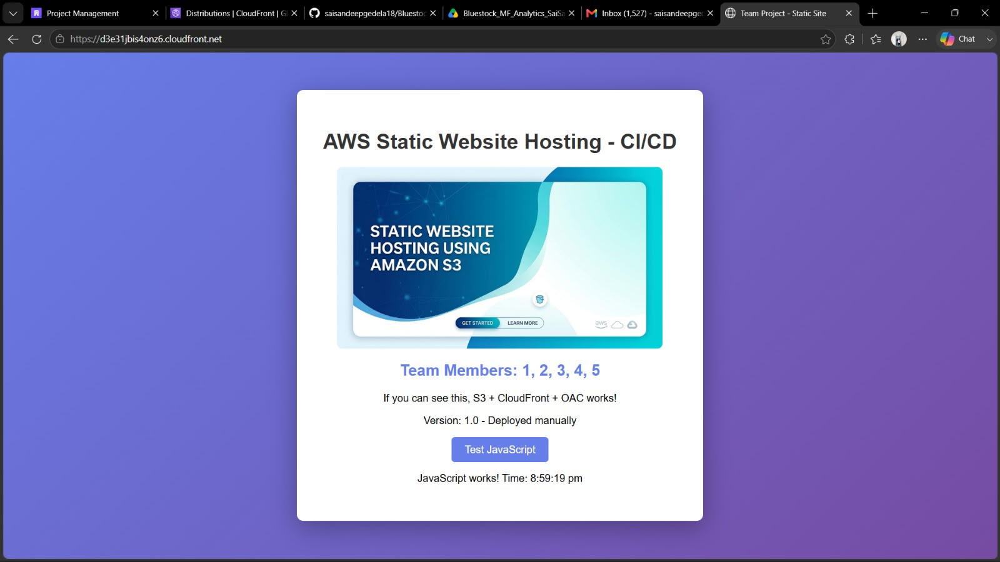
</p>

---

## ☁️ Amazon CloudFront

### Distribution Overview

<p align="center">
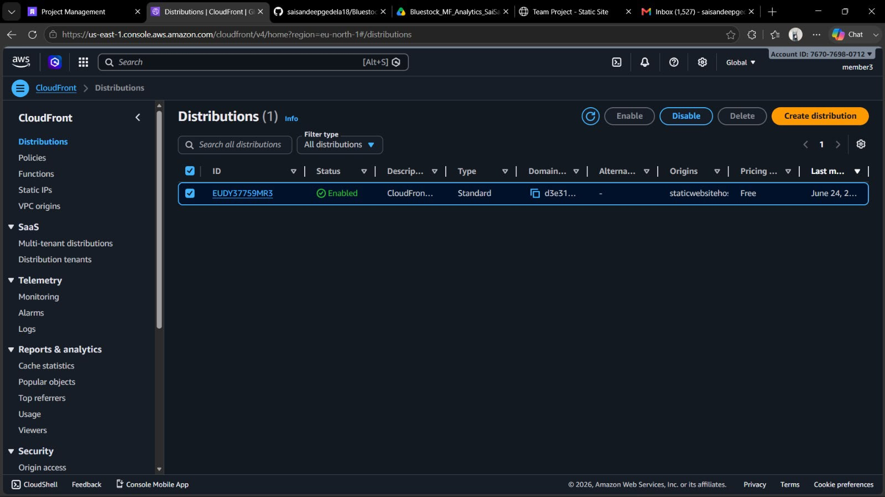
</p>

### Distribution Details

<p align="center">
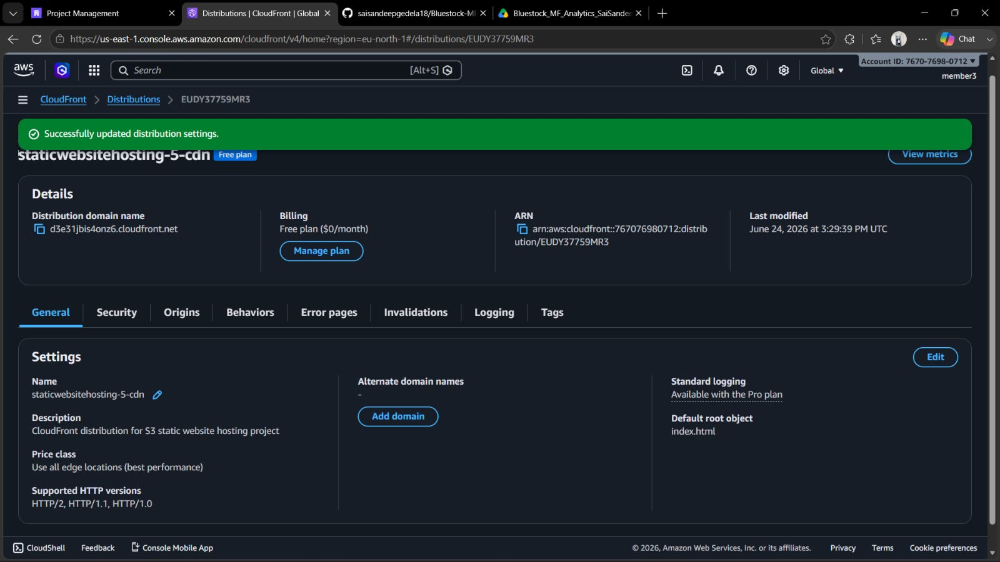
</p>

### Origin Access Control (OAC)

<p align="center">
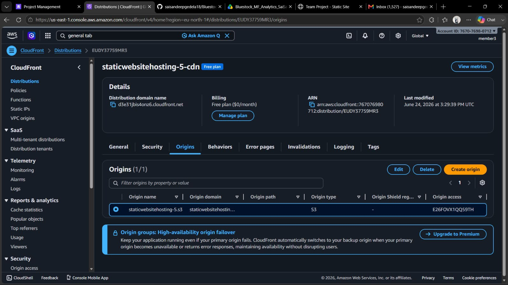
</p>

---

## 🔄 CI/CD Pipeline

### Successful Pipeline Execution

<p align="center">
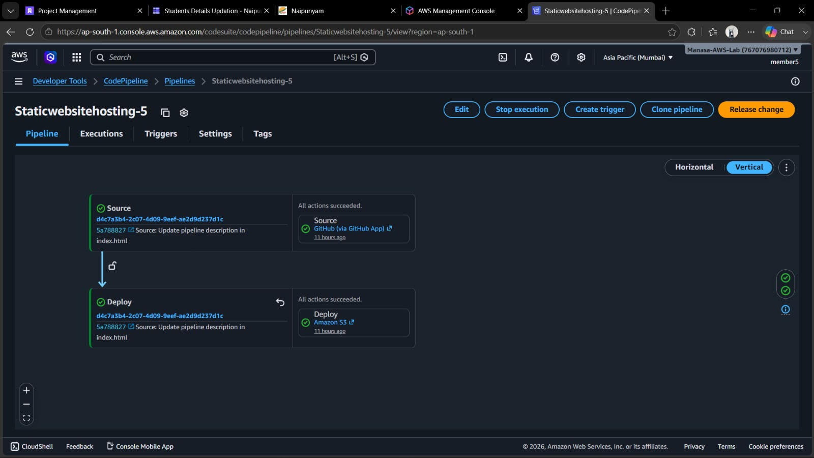
</p>

### Pipeline Executions

<p align="center">
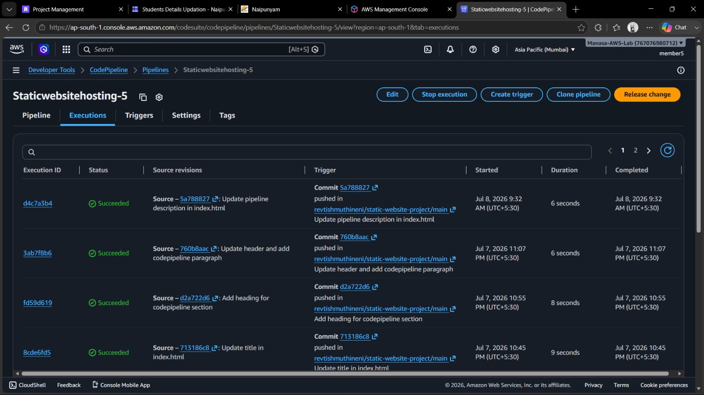
</p>

### GitHub Connection

<p align="center">
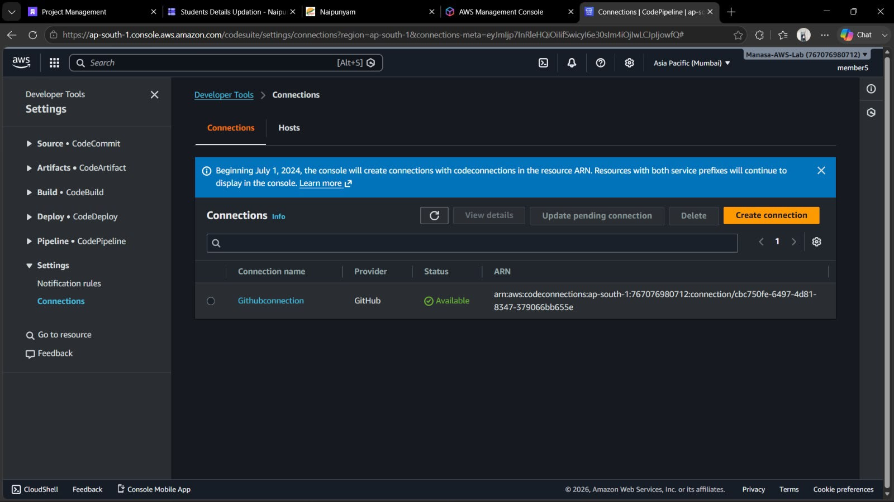
</p>

---

## 📊 Cloud Monitoring

### Amazon CloudWatch Dashboard

<p align="center">
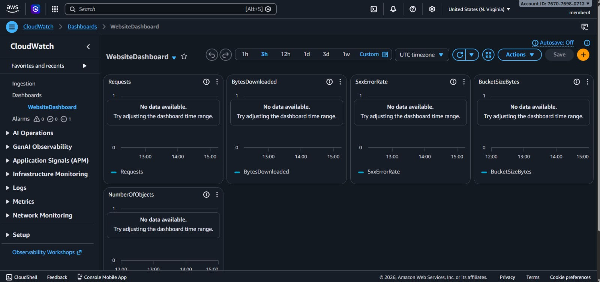
</p>

### Dashboard Creation

<p align="center">
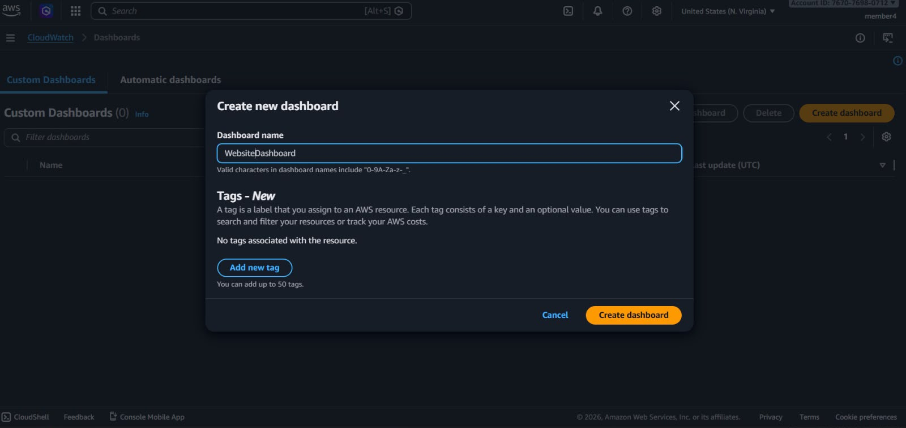
</p>

---

## 🚨 CloudWatch Alarm

### Alarm Configuration

<p align="center">
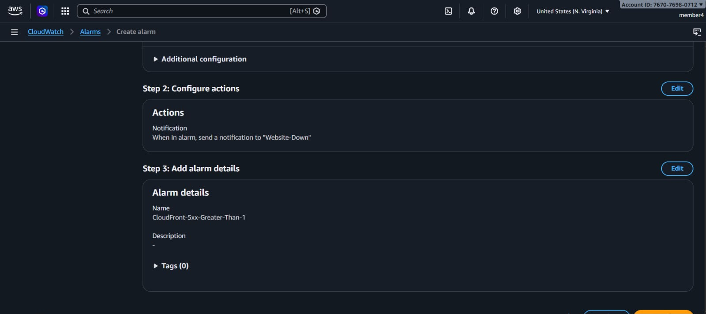
</p>

### Alarm Created Successfully

<p align="center">
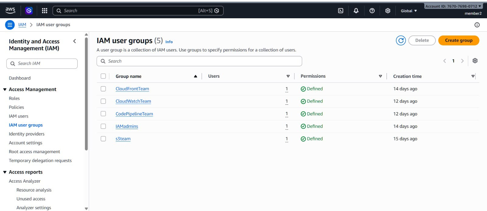
</p>

### Alarm List

<p align="center">
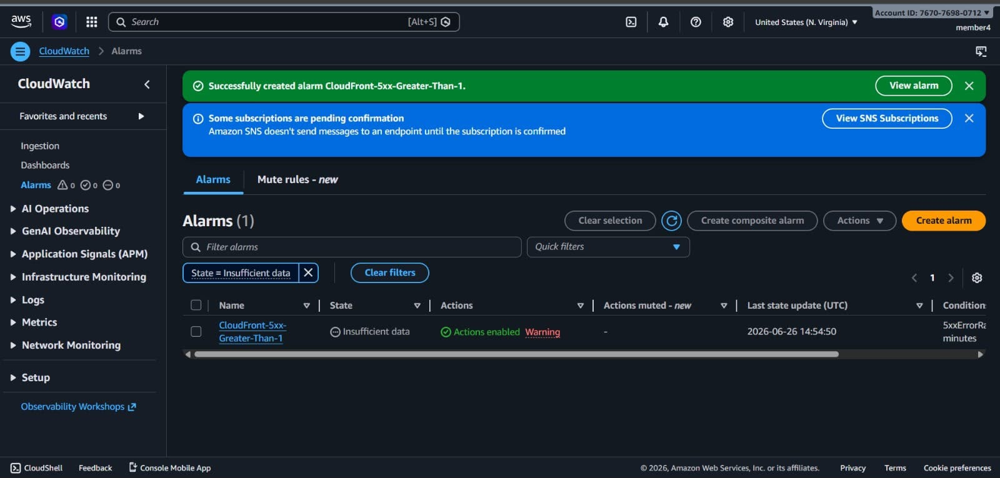
</p>

---

## 📧 Amazon SNS Notification

<p align="center">
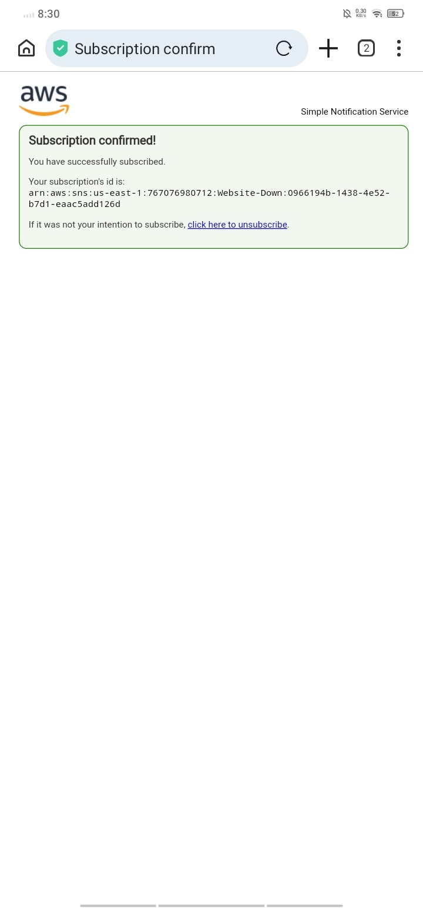
</p>

---

## 👥 IAM Configuration

### IAM User Groups

<p align="center">
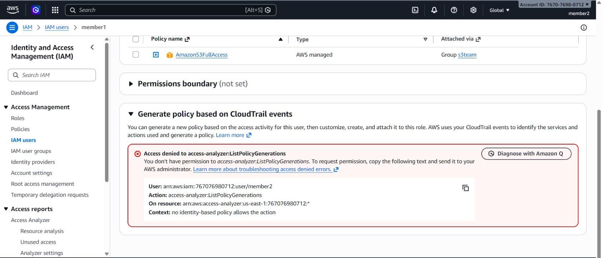
</p>

### Member 3 Permissions (CloudFront)

<p align="center">
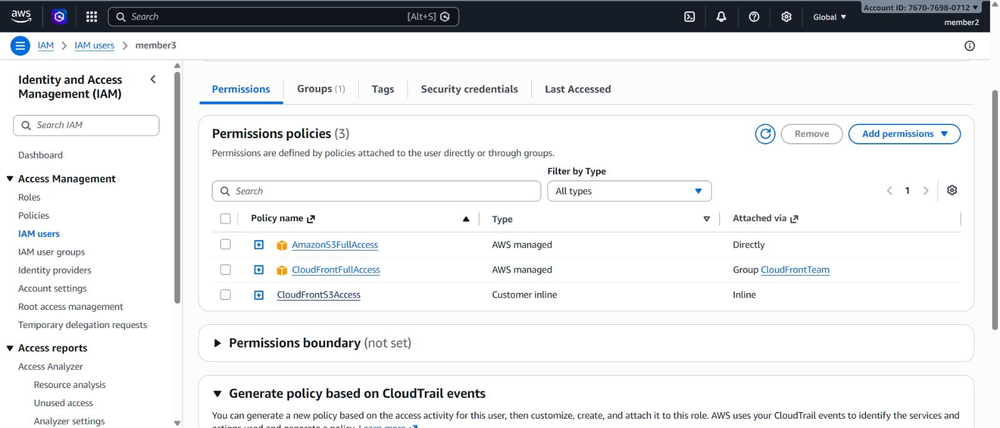
</p>

### Member 4 Permissions (CloudWatch)

<p align="center">
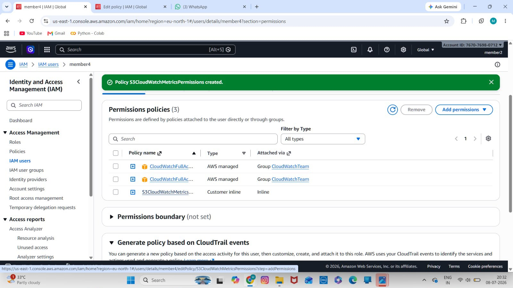
</p>

### Member 5 Permissions (CodePipeline)

<p align="center">
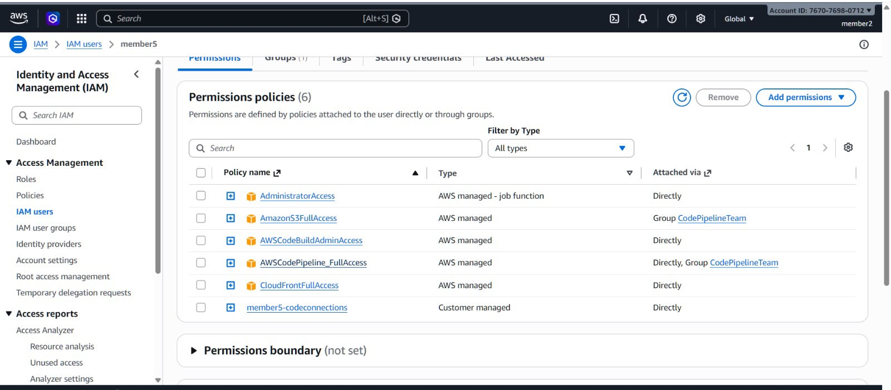
</p>

---

# 📈 Project Outcome

This project successfully demonstrates the implementation of an end-to-end AWS DevOps workflow using core AWS services.

### Achievements

- ✅ Hosted a responsive static website using Amazon S3
- ✅ Configured Amazon CloudFront for secure global content delivery
- ✅ Implemented Origin Access Control (OAC)
- ✅ Automated deployments using AWS CodePipeline
- ✅ Connected GitHub for source control and CI/CD
- ✅ Configured Amazon CloudWatch Dashboard
- ✅ Created CloudWatch Alarms
- ✅ Configured Amazon SNS Email Notifications
- ✅ Applied IAM least-privilege security
- ✅ Validated the application through CloudFront

---
# 👨‍💻 My Contribution

As **Member 3 (CloudFront Owner)**, I was responsible for designing, configuring, and validating the secure content delivery layer of the project.

### Responsibilities

- ☁️ Configured Amazon CloudFront Distribution
- 🔒 Implemented Origin Access Control (OAC)
- 🔗 Integrated Amazon S3 with CloudFront
- 📄 Configured Default Root Object (`index.html`)
- 🌐 Validated website accessibility through the CloudFront domain
- 🧪 Performed deployment testing and verification
- 📸 Collected implementation evidence and project screenshots
- 📚 Prepared the GitHub repository and technical documentation

---

# 👥 Team Contributions

| Team Member | Responsibility |
|-------------|----------------|
| **Member 1** | Amazon S3 Bucket Creation, Static Website Hosting, Bucket Policy |
| **Member 2** | IAM Users, Groups & Access Management |
| **Sai Sandeep Gedela (Member 3)** | Amazon CloudFront, Origin Access Control (OAC), Website Validation & Documentation |
| **Member 4** | Amazon CloudWatch Dashboard, Alarms & Amazon SNS |
| **Member 5** | GitHub Integration & AWS CodePipeline |

---

# 🛠️ Technologies Used

### Cloud Services

- Amazon S3
- Amazon CloudFront
- AWS IAM
- AWS CodePipeline
- Amazon CloudWatch
- Amazon SNS

### Web Technologies

- HTML5
- CSS3
- JavaScript

### Version Control

- Git
- GitHub

---

# 🎓 Skills Demonstrated

This project showcases practical experience in:

- AWS Cloud Fundamentals
- Static Website Hosting
- Content Delivery Networks (CDN)
- Continuous Integration & Continuous Deployment (CI/CD)
- Cloud Monitoring
- Cloud Security
- IAM Policy Management
- GitHub Version Control
- Infrastructure Deployment
- Team Collaboration

---

# 📚 Key Learning Outcomes

Through this project, I gained hands-on experience in:

- Deploying production-inspired workloads on AWS
- Configuring secure access using Origin Access Control
- Building an automated deployment pipeline
- Monitoring AWS resources using CloudWatch
- Configuring notifications with Amazon SNS
- Applying the Principle of Least Privilege
- Working collaboratively in a cloud-based team project

---

# 🚀 Future Enhancements

Potential improvements include:

- 🌍 Amazon Route 53 Custom Domain
- 🔐 HTTPS using AWS Certificate Manager (ACM)
- 🛡️ AWS WAF Integration
- ⚙️ Infrastructure as Code (Terraform)
- ☁️ AWS CloudFormation Templates
- 🚀 GitHub Actions Integration
- 📈 CloudWatch Logs & Insights
- 🧪 Automated Testing before deployment

---

# 🏆 Project Highlights

- ✅ Secure Static Website Hosting
- ✅ Global Content Delivery
- ✅ Automated CI/CD Deployment
- ✅ Cloud Monitoring & Alerting
- ✅ IAM Least-Privilege Security
- ✅ Origin Access Control (OAC)
- ✅ GitHub Integration
- ✅ Production-inspired AWS Architecture

---
## 📄 Documentation

📘 **Project Report**

👉 [AWS Static Website Hosting CICD Report.pdf](Documentation/AWS%20Static%20Website%20Hosting%20CICD%20Report.pdf)

📊 **Project Presentation**

👉 [AWS Static Website CICD (1).pptx](Documentation/AWS%20Static%20Website%20CICD%20(1).pptx)

# 📜 Acknowledgements

This project was completed as part of an **AWS DevOps Internship**.

I sincerely thank my teammates, mentors, and the internship organizers for their guidance and collaboration throughout the project.

---

# 👤 Author

<div align="center">

## Sai Sandeep Gedela

**B.Tech – Computer Science & Engineering**

**AWS DevOps Intern**

📍 Andhra University

</div>

### 🌐 Connect with Me

- **GitHub:** https://github.com/saisandeepgedela18
- **LinkedIn:** https://www.linkedin.com/in/sai-sandeep-gedela

---
# 📈 Project Metrics

| Category | Details |
|----------|----------|
| ☁️ Cloud Provider | Amazon Web Services (AWS) |
| 🌐 Hosting Service | Amazon S3 |
| 🚀 CDN | Amazon CloudFront |
| 🔒 Security | Origin Access Control (OAC) |
| 🔄 CI/CD | AWS CodePipeline |
| 📊 Monitoring | Amazon CloudWatch |
| 📧 Notifications | Amazon SNS |
| 👥 Identity Management | AWS IAM |
| 💻 Frontend | HTML5, CSS3, JavaScript |
| 📂 Source Control | Git & GitHub |

---

# 🧪 Validation Checklist

The following project components were successfully implemented and verified:

| Status | Component |
|:------:|-----------|
| ✅ | Amazon S3 Static Website Hosting |
| ✅ | CloudFront Distribution |
| ✅ | Origin Access Control (OAC) |
| ✅ | GitHub Repository Integration |
| ✅ | AWS CodePipeline Deployment |
| ✅ | CloudWatch Dashboard |
| ✅ | CloudWatch Alarm |
| ✅ | Amazon SNS Notification |
| ✅ | IAM Users & Groups |
| ✅ | End-to-End Website Validation |

---

# 🎯 Core DevOps Concepts Demonstrated

- Continuous Integration (CI)
- Continuous Deployment (CD)
- Infrastructure Monitoring
- Secure Cloud Storage
- Global Content Delivery
- Identity & Access Management
- Cloud Security Best Practices
- Automated Deployment Pipeline
- Version Control using GitHub
- AWS Resource Management

---

# 📖 What I Learned

During this project I gained practical experience in:

- Designing cloud-based web hosting solutions
- Deploying static websites on AWS
- Configuring CloudFront with Origin Access Control
- Building an automated deployment pipeline
- Monitoring AWS resources with CloudWatch
- Creating operational alerts using Amazon SNS
- Managing IAM users, groups, and permissions
- Working collaboratively in a team-based AWS environment

---

# 🌟 Why This Project Matters

This project demonstrates the practical implementation of core AWS and DevOps concepts commonly used in modern cloud environments.

It showcases:

- Cloud Infrastructure Deployment
- Secure Content Delivery
- Continuous Deployment
- Monitoring & Alerting
- AWS Security Best Practices
- Team Collaboration
- Real-world DevOps Workflow

---

# 🙏 Special Thanks

I would like to thank:

- AWS
- Internship Mentors
- My Project Team
- Open Source Community
- GitHub

for providing the learning resources and platform that made this project possible.

---

# 📌 Repository Information

⭐ Feel free to fork this repository.

🐛 Found an issue? Open an Issue.

💡 Suggestions are always welcome.

🤝 Contributions are appreciated.

---

<div align="center">

## 🚀 Thank You for Visiting!

If you found this repository useful,

⭐ Star the repository

🍴 Fork it

📢 Share it

---

### Built with ❤️ by Sai Sandeep Gedela


</div>

# 📄 License

This project is licensed under the **MIT License**.

It is intended for educational, learning, and portfolio purposes.

---

<div align="center">

## ⭐ Support the Project

If you found this project helpful,

⭐ Star the repository

🍴 Fork the repository

📢 Share it with others

---

### 🚀 Thank you for visiting!

**Made with ❤️ by Sai Sandeep Gedela**


</div>

